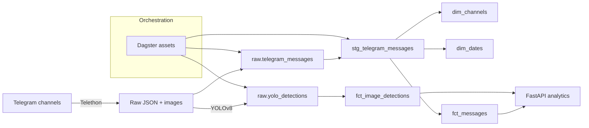

# Medical Telegram Warehouse

[](https://www.python.org/)
[](https://fastapi.tiangolo.com/)
[](https://www.getdbt.com/)
[](https://dagster.io/)
[](https://docs.ultralytics.com/)

Portfolio-ready Telegram ELT pipeline that ingests medical channel content, enriches images with YOLOv8, models a star schema in dbt, and exposes analytics through a FastAPI service orchestrated by Dagster.

## Project Overview
- **Goal:** Build an end-to-end ELT pipeline for Telegram medical content and make it analytics-ready.
- **Inputs:** Telegram messages + images from curated channels.
- **Outputs:** PostgreSQL warehouse (raw, staging, marts), enriched YOLO detections, and API endpoints for reports.

## Tech Stack
- **Ingestion:** Telethon
- **Warehouse:** PostgreSQL + dbt
- **Enrichment:** YOLOv8 (Ultralytics)
- **API:** FastAPI + SQLAlchemy
- **Orchestration:** Dagster
- **Infra:** Docker Compose

## Quick Start
1. Create `.env` from `.env.example` and fill in Telegram and database values.
2. Install dependencies:
   ```bash
   python -m venv .venv
   source .venv/Scripts/activate
   pip install -r requirements.txt
   ```
3. Run the scraper (raw JSON + images):
   ```bash
   python src/scraper.py
   ```
4. Load raw data into Postgres:
   ```bash
   python src/load_raw.py
   ```
5. Run dbt transformations:
   ```bash
   cd medical_warehouse
   dbt run --select staging marts
   dbt test
   ```
6. Start the API:
   ```bash
   uvicorn api.main:app --reload
   ```

Optional: run the API via Docker Compose:
```bash
docker-compose up --build
```

## Architecture Summary


## Repository Structure
- `api/` FastAPI application and routers
- `src/` Scraper, raw loader, YOLO inference
- `medical_warehouse/` dbt project (staging + marts)
- `dagster_project/` Dagster assets and resources
- `data/` Raw and enriched artifacts
- `docs/` Data dictionary and diagrams

## Future Improvements
- Add incremental loads for raw and staging layers
- Track schema changes with dbt exposures and docs site
- Add topic modeling for message text
- Enrich detections with more domain-specific classes
- Add CI for dbt + API tests
